# Final Thesis Documentation

## Title Page

**Title:** Design and Implementation of a Multi-Bank Transaction Verification Platform with Image-Based Receipt Extraction and AI-Assisted Fraud Scoring

**Author:** Kokeb Tesfay

**Advisor:** [Advisor Name]

**Department:** [Department]

**Institution:** [University]

**Degree:** [Degree Name]

**Date:** May 2026

---

## Declaration

I declare that this thesis is my original work and that all sources used are acknowledged appropriately.

**Signature:** ______________________

**Date:** ______________________

---

## Approval Page

This thesis has been reviewed and accepted by:

- Advisor: ______________________
- Examiner 1: ______________________
- Examiner 2: ______________________

---

## Acknowledgements

I would like to express my sincere gratitude to my advisor and department for their continuous support and guidance. I also extend my thanks to the open-source community for the foundational tools that made this implementation possible.

---

## Abstract

This thesis presents the design and implementation of a multi-bank payment verification platform that consolidates manual verification, image-based receipt extraction, transaction history management, and AI-assisted fraud scoring into a single unified system. The platform targets the operational verification needs of merchants, finance teams, and service providers who must validate payment receipts across multiple Ethiopian banks and mobile money providers.

The system features a Node.js verification API, a React-based operational dashboard, and a Python FastAPI microservice dedicated to fraud scoring. Receipts can be verified either by explicit reference numbers or through uploaded receipt images. The image extraction pipeline employs a hybrid approach, using local Optical Character Recognition (OCR) for rapid, deterministic extraction based on bank-specific heuristics, and a vision model fallback for complex or degraded receipts. Furthermore, a proof-of-concept machine learning module provides risk scores, anomaly flags, contributing features, and reason codes to support human-in-the-loop review processes.

The project contributes a practical, end-to-end verification workflow featuring robust history tracking, safe retry semantics to preserve audit integrity, and exportable reporting capabilities. The machine learning layer demonstrates how probabilistic fraud signals can be integrated into operational workflows alongside deterministic ledger validation, using an Isolation Forest anomaly detector calibrated by Logistic Regression. Evaluation results show strong performance on various synthetic fraud classes, while exposing the limitations of detecting OCR fuzzing attacks, highlighting the challenges of document verification and providing a roadmap for future research.

---

## Table of Contents

[1. Introduction](#chapter-1-introduction) <br>
&nbsp;&nbsp;&nbsp;&nbsp;[1.1 Background](#11-background) <br>
&nbsp;&nbsp;&nbsp;&nbsp;[1.2 Problem Statement](#12-problem-statement) <br>
&nbsp;&nbsp;&nbsp;&nbsp;[1.3 Objectives](#13-objectives) <br>
&nbsp;&nbsp;&nbsp;&nbsp;&nbsp;&nbsp;&nbsp;&nbsp;[1.3.1 General Objective](#131-general-objective) <br>
&nbsp;&nbsp;&nbsp;&nbsp;&nbsp;&nbsp;&nbsp;&nbsp;[1.3.2 Specific Objectives](#132-specific-objectives) <br>
&nbsp;&nbsp;&nbsp;&nbsp;[1.4 Significance of the Work](#14-significance-of-the-work) <br>
&nbsp;&nbsp;&nbsp;&nbsp;[1.5 Scope and Limitations](#15-scope-and-limitations) <br>
&nbsp;&nbsp;&nbsp;&nbsp;[1.6 Research Questions](#16-research-questions) <br>
[2. Literature Review](#chapter-2-literature-review) <br>
&nbsp;&nbsp;&nbsp;&nbsp;[2.1 Theoretical Background](#21-theoretical-background) <br>
&nbsp;&nbsp;&nbsp;&nbsp;&nbsp;&nbsp;&nbsp;&nbsp;[2.1.1 The Challenge of Payment Fraud Detection](#211-the-challenge-of-payment-fraud-detection) <br>
&nbsp;&nbsp;&nbsp;&nbsp;&nbsp;&nbsp;&nbsp;&nbsp;[2.1.2 The Document Information Extraction Bottleneck](#212-the-document-information-extraction-bottleneck) <br>
&nbsp;&nbsp;&nbsp;&nbsp;[2.2 Related Works](#22-related-works) <br>
&nbsp;&nbsp;&nbsp;&nbsp;&nbsp;&nbsp;&nbsp;&nbsp;[2.2.1 Algorithmic Approaches to Anomaly Detection](#221-algorithmic-approaches-to-anomaly-detection) <br>
&nbsp;&nbsp;&nbsp;&nbsp;&nbsp;&nbsp;&nbsp;&nbsp;[2.2.2 Probability Calibration and Operational Interpretability](#222-probability-calibration-and-operational-interpretability) <br>
&nbsp;&nbsp;&nbsp;&nbsp;&nbsp;&nbsp;&nbsp;&nbsp;[2.2.3 The "Architectural Impasse": Deterministic vs. Probabilistic Systems](#223-the-architectural-impasse-deterministic-vs-probabilistic-systems) <br>
&nbsp;&nbsp;&nbsp;&nbsp;[2.3 Summary of Knowledge Gaps](#23-summary-of-knowledge-gaps) <br>
&nbsp;&nbsp;&nbsp;&nbsp;&nbsp;&nbsp;&nbsp;&nbsp;[2.3.1 Synthesis and Research Gap](#231-synthesis-and-research-gap) <br>
[3. Methodology and System Design](#chapter-3-methodology-and-system-design) <br>
&nbsp;&nbsp;&nbsp;&nbsp;[3.1 Design Requirements](#31-design-requirements) <br>
&nbsp;&nbsp;&nbsp;&nbsp;&nbsp;&nbsp;&nbsp;&nbsp;[3.1.1 Functional Requirements](#311-functional-requirements) <br>
&nbsp;&nbsp;&nbsp;&nbsp;&nbsp;&nbsp;&nbsp;&nbsp;[3.1.2 Non-Functional Requirements](#312-non-functional-requirements) <br>
&nbsp;&nbsp;&nbsp;&nbsp;[3.2 System Architecture/Model](#32-system-architecturemodel) <br>
&nbsp;&nbsp;&nbsp;&nbsp;&nbsp;&nbsp;&nbsp;&nbsp;[3.2.1 High-Level Architecture Overview](#321-high-level-architecture-overview) <br>
&nbsp;&nbsp;&nbsp;&nbsp;&nbsp;&nbsp;&nbsp;&nbsp;[3.2.2 The Deterministic-First Verification Sequence](#322-the-deterministic-first-verification-sequence) <br>
&nbsp;&nbsp;&nbsp;&nbsp;&nbsp;&nbsp;&nbsp;&nbsp;[3.2.3 Technology Stack](#323-technology-stack) <br>
&nbsp;&nbsp;&nbsp;&nbsp;&nbsp;&nbsp;&nbsp;&nbsp;[3.2.4 Deployment Topology](#324-deployment-topology) <br>
&nbsp;&nbsp;&nbsp;&nbsp;[3.3 Implementation](#33-implementation) <br>
&nbsp;&nbsp;&nbsp;&nbsp;&nbsp;&nbsp;&nbsp;&nbsp;[3.3.1 Backend Design and Adapters](#331-backend-design-and-adapters) <br>
&nbsp;&nbsp;&nbsp;&nbsp;&nbsp;&nbsp;&nbsp;&nbsp;[3.3.2 Image Verification and Receipt Parsing Pipeline](#332-image-verification-and-receipt-parsing-pipeline) <br>
&nbsp;&nbsp;&nbsp;&nbsp;&nbsp;&nbsp;&nbsp;&nbsp;[3.3.3 Fraud Detection Proof of Concept](#333-fraud-detection-proof-of-concept) <br>
&nbsp;&nbsp;&nbsp;&nbsp;&nbsp;&nbsp;&nbsp;&nbsp;[3.3.4 Database Design](#334-database-design) <br>
&nbsp;&nbsp;&nbsp;&nbsp;&nbsp;&nbsp;&nbsp;&nbsp;[3.3.5 Frontend Design and Implementation](#335-frontend-design-and-implementation) <br>
&nbsp;&nbsp;&nbsp;&nbsp;&nbsp;&nbsp;&nbsp;&nbsp;[3.3.6 Security, Cryptography, and Auditability](#336-security-cryptography-and-auditability) <br>
&nbsp;&nbsp;&nbsp;&nbsp;[3.4 Data Collection/Simulation Setup](#34-data-collectionsimulation-setup) <br>
&nbsp;&nbsp;&nbsp;&nbsp;&nbsp;&nbsp;&nbsp;&nbsp;[3.4.1 Research Method and Iterative Development](#341-research-method-and-iterative-development) <br>
&nbsp;&nbsp;&nbsp;&nbsp;&nbsp;&nbsp;&nbsp;&nbsp;[3.4.2 Data Generation and ML Training Strategy](#342-data-generation-and-ml-training-strategy) <br>
[4. Results and Discussion](#chapter-4-results-and-discussion) <br>
&nbsp;&nbsp;&nbsp;&nbsp;[4.1 Experimental/Simulation Results](#41-experimentalsimulation-results) <br>
&nbsp;&nbsp;&nbsp;&nbsp;&nbsp;&nbsp;&nbsp;&nbsp;[4.1.1 Component Level Validation](#411-component-level-validation) <br>
&nbsp;&nbsp;&nbsp;&nbsp;&nbsp;&nbsp;&nbsp;&nbsp;[4.1.2 System-Level Integration Scenarios](#412-system-level-integration-scenarios) <br>
&nbsp;&nbsp;&nbsp;&nbsp;&nbsp;&nbsp;&nbsp;&nbsp;[4.1.3 Synthetic Dataset Characteristics](#413-synthetic-dataset-characteristics) <br>
&nbsp;&nbsp;&nbsp;&nbsp;[4.2 Performance Analysis](#42-performance-analysis) <br>
&nbsp;&nbsp;&nbsp;&nbsp;&nbsp;&nbsp;&nbsp;&nbsp;[4.2.1 Global Model Performance](#421-global-model-performance) <br>
&nbsp;&nbsp;&nbsp;&nbsp;&nbsp;&nbsp;&nbsp;&nbsp;[4.2.2 Attack Vector Analysis](#422-attack-vector-analysis) <br>
&nbsp;&nbsp;&nbsp;&nbsp;&nbsp;&nbsp;&nbsp;&nbsp;[4.2.3 Evaluation in Relation to Objectives](#423-evaluation-in-relation-to-objectives) <br>
&nbsp;&nbsp;&nbsp;&nbsp;[4.3 Discussion](#43-discussion) <br>
&nbsp;&nbsp;&nbsp;&nbsp;&nbsp;&nbsp;&nbsp;&nbsp;[4.3.1 Comparison to Existing Solutions](#431-comparison-to-existing-solutions) <br>
&nbsp;&nbsp;&nbsp;&nbsp;&nbsp;&nbsp;&nbsp;&nbsp;[4.3.2 The Proof of Concept Limitations](#432-the-proof-of-concept-limitations) <br>
&nbsp;&nbsp;&nbsp;&nbsp;&nbsp;&nbsp;&nbsp;&nbsp;[4.3.3 Limitations and Threats to Validity](#433-limitations-and-threats-to-validity) <br>
[5. Conclusions and Recommendations](#chapter-5-conclusions-and-recommendations) <br>
&nbsp;&nbsp;&nbsp;&nbsp;[5.1 Conclusion](#51-conclusion) <br>
&nbsp;&nbsp;&nbsp;&nbsp;[5.2 Contributions](#52-contributions) <br>
&nbsp;&nbsp;&nbsp;&nbsp;[5.3 Recommendations](#53-recommendations) <br>
[References](#references) <br>
[Appendices](#appendices) <br>
&nbsp;&nbsp;&nbsp;&nbsp;[Appendix A: Detailed Data Dictionary](#appendix-a-detailed-data-dictionary) <br>

---

## List of Figures

- Figure 1: High-Level System Architecture
- Figure 2: Verification Request Sequence Diagram
- Figure 3: Technology Stack Overview
- Figure 4: Deployment Architecture
- Figure 5: Image Verification Pipeline
- Figure 6: Fraud Detection ML Pipeline
- Figure 7: Database Entity-Relationship Diagram
- Figure 8: Frontend Navigation Map
- Figure 9: ML Performance: ROC Curve
- Figure 10: ML Performance: Precision-Recall Curve
- Figure 11: ML Performance: Confusion Matrix
- Figure 12: ML Performance: Per-Attack Performance
- Figure 13: ML Performance: Feature Importance
- Figure 14: ML Performance: Risk Score Distribution

---

## List of Tables

- Table 1: System Requirements
- Table 2: Related Work Synthesis and Gap Analysis
- Table 3: Bank Capability Matrix
- Table 4: Dataset Summary
- Table 5: Model Hyperparameters
- Table 6: Model Performance Metrics
- Table 7: Confusion Matrix
- Table 8: Per-Attack Detection Rates
- Table 9: Frontend Pages and Purpose
- Table 10: Limitations and Mitigations

---

## Abbreviations and Acronyms

- AI: Artificial Intelligence
- API: Application Programming Interface
- ETB: Ethiopian Birr
- IF: Isolation Forest
- JWT: JSON Web Token
- LR: Logistic Regression
- ML: Machine Learning
- OCR: Optical Character Recognition
- ORM: Object-Relational Mapping
- PII: Personally Identifiable Information
- PR-AUC: Precision-Recall Area Under Curve
- REST: Representational State Transfer
- ROC-AUC: Receiver Operating Characteristic Area Under Curve
- SPA: Single Page Application

---

# Chapter 1: Introduction

## 1.1 Background

In the contemporary digital economy, payment verification is a foundational operational activity for merchants, service providers, and enterprise finance teams. Within Ethiopia's rapidly digitizing financial landscape, payment receipts are generated across a highly fragmented ecosystem encompassing traditional commercial banks and emerging mobile money platforms. The verification process typically involves manual inspection of digital receipts (often shared as screenshots via messaging applications), manually checking reference numbers against bank portals, and subsequently maintaining disparate records in spreadsheets or physical logbooks. 

This workflow is inherently slow, highly susceptible to human error, and lacks the structural rigor required for compliance and auditability. As transaction volumes scale, the manual verification bottleneck becomes a significant operational liability, exposing businesses to various forms of payment fraud, including replay attacks, amount tampering, and receipt forgery.

Modern enterprise verification systems require a paradigm shift: they must seamlessly accept multimodal inputs (both raw reference strings and receipt images), normalize diverse provider outputs into a consistent schema, preserve an immutable audit trail, and integrate risk intelligence signals. This thesis proposes and implements a comprehensive system that synthesizes these requirements into a singular, highly practical verification platform.

## 1.2 Problem Statement

Existing payment verification workflows in the Ethiopian context suffer from severe fragmentation and an absence of standardized auditing protocols, creating a significant operational liability. Verification currently relies heavily on human operators parsing non-standardized screenshots, which inevitably leads to fatigue and oversight. Because each banking institution and mobile money provider utilizes distinct receipt layouts, typographies, and reference number structures, automated extraction is exceedingly complicated. Furthermore, the absence of unified audit trails means verification outcomes are rarely consolidated, making it incredibly difficult to trace transaction histories or successfully resolve disputes. Compounding this issue is the fact that traditional systems provide only simple, binary "success" or "failure" flags, completely lacking the contextual nuance required to identify sophisticated fraud attempts. Consequently, advanced fraud intelligence signals remain siloed and disconnected from the daily operational workflows of finance personnel.

## 1.3 Objectives

### 1.3.1 General Objective
To design, implement, and evaluate a multi-bank verification platform that supports both manual and image-based receipt verification, maintains robust audit records, and integrates a proof-of-concept AI-based fraud scoring module.

### 1.3.2 Specific Objectives
- To architect and deploy bank-specific deterministic verification adapters for multiple major Ethiopian payment providers.
- To develop an intelligent receipt image extraction pipeline utilizing Optical Character Recognition (OCR) and fallback generative vision models.
- To normalize verification outputs and architect a relational database schema for comprehensive transaction history and retry semantics.
- To simulate synthetic fraud data and integrate a Python-based machine learning microservice to provide interpretable fraud risk scores and anomaly explanations.
- To construct a professional, secure React-based operational dashboard for streamlined operational usage.

## 1.4 Significance of the Work

The motivation and significance for this project stem from the critical need to bridge the gap between complex financial integrations and usable operational software. Specific drivers include:
- The necessity for a unified API interface that obscures the complexity of verifying receipts across multiple disparate providers.
- The demand for reliable image-based verification to accommodate the prevalent user behavior of sharing payment screenshots.
- The requirement for a searchable, exportable, and tamper-evident history system.
- The opportunity to augment deterministic verification with AI-assisted fraud signals, shifting from basic validation to intelligent risk assessment.

## 1.5 Scope and Limitations

The scope of this system encompasses manual reference verification, image-based receipt parsing, transaction history management, and AI risk scoring. It supports a predefined set of major Ethiopian providers. 

Crucially, the system does not claim to provide official, enterprise-grade bank settlement reconciliation. It is designed for operational receipt verification. Furthermore, the AI fraud scoring module is explicitly designated as a proof of concept; due to the extreme difficulty in obtaining real-world labeled financial fraud datasets, the machine learning models are trained and evaluated on synthetically generated data that mimics observed attack vectors.

## 1.6 Research Questions

This thesis seeks to answer the following research questions:

1. How can a unified software architecture effectively normalize and parse verification data across highly varied bank receipt formats and APIs?
2. To what extent can an image-based extraction pipeline, utilizing OCR and specific parsing heuristics, achieve reliable routing and reference capture in real-world workflows?
3. How can a proof-of-concept machine learning model be integrated into a deterministic verification system to provide meaningful fraud signals without disrupting authoritative ledger checks?
4. What are the specific performance characteristics and failure modes of anomaly detection models when applied to synthetic receipt metadata?

---

# Chapter 2: Literature Review

## 2.1 Theoretical Background

### 2.1.1 The Challenge of Payment Fraud Detection
The digitization of financial services has precipitated a corresponding escalation in sophisticated payment fraud. Academic literature consistently highlights that static, rules-based defense mechanisms are increasingly insufficient to combat evolving threat typologies [7]. Research by Sonam et al. emphasizes the necessity of transitioning toward machine learning frameworks capable of generalizing from historical data to identify previously unseen fraudulent patterns in digital payment ecosystems [9]. Similarly, Shankar et al. document the broader industry shift toward AI-augmented detection systems, validating that algorithmic approaches significantly outperform manual auditing in both speed and accuracy [10]. However, much of this foundational research evaluates fraud detection strictly within the context of structured, tabular transaction streams generated at the banking core, often ignoring the operational reality where fraud occurs at the edge via falsified digital receipts and manipulated images.

### 2.1.2 The Document Information Extraction Bottleneck
Before algorithmic fraud detection can be applied at the edge, unstructured visual data must be converted into structured metadata. The open-source Tesseract engine is widely utilized in academic research as a foundational baseline for Optical Character Recognition (OCR) [1]. While Tesseract serves as a baseline, recent literature demonstrates severe limitations when processing non-standard, noise-heavy financial documents [2]. Digital receipts "in the wild" suffer from diverse typographies, background interference, and compression artifacts, which frequently cause deterministic OCR parsers to output severely degraded text strings. Consequently, contemporary research increasingly relies on hybrid document understanding pipelines. Advanced architectures, such as multimodal deep networks, leverage Large Language Models (LLMs) to infer semantic entities from noisy OCR outputs or bypass OCR entirely in favor of direct visual-textual spatial reasoning [3]. 

## 2.2 Related Works

### 2.2.1 Algorithmic Approaches to Anomaly Detection
Once structured metadata is extracted, analyzing it for fraudulent intent presents a significant algorithmic challenge. Fraud datasets are notoriously imbalanced, with illicit transactions often constituting less than 0.1% of all activity. Traditional supervised classifiers often suffer from majority-class bias in such environments, yielding unacceptably high false-negative rates [8]. Furthermore, traditional density-based anomaly detectors experience performance degradation in high-dimensional feature spaces due to the "curse of dimensionality" and are susceptible to masking effects [4].

To address these limitations, Liu et al. introduced the Isolation Forest algorithm [4]. Rather than attempting to profile the complex distribution of "normal" behavior, Isolation Forests explicitly target anomalies. By constructing an ensemble of random decision trees, the algorithm isolates anomalies closer to the root of the trees. The literature identifies this mechanism as highly optimal for financial fraud metadata, as it maintains robustness across highly imbalanced, multi-dimensional distributions.

### 2.2.2 Probability Calibration and Operational Interpretability
While algorithms like the Isolation Forest excel at separating anomalous records, they generate abstract, uncalibrated scores (e.g., path lengths or negative distances) rather than true probabilities. Academic research heavily critiques the deployment of uncalibrated scores in operational environments, as they preclude the establishment of rational, human-interpretable risk thresholds [6].

To solve this, the literature advocates for post-hoc probability calibration techniques. Platt Scaling, originally introduced for Support Vector Machines, demonstrates that fitting a logistic regression model to the raw outputs of a classifier can successfully squash unbounded scores into a strict, well-calibrated posterior probability distribution [5]. Modern extensions of this research confirm that applying logistic calibration to anomaly scores allows downstream systems to treat the output as a definitive risk percentage, directly supporting human-in-the-loop review protocols [6].

### 2.2.3 The "Architectural Impasse": Deterministic vs. Probabilistic Systems
A recurring debate within financial technology literature is the tension between deterministic compliance and probabilistic adaptability. Financial systems require rigid adherence to deterministic rules (e.g., verifying that a ledger reference explicitly exists) to maintain auditability and regulatory compliance [7]. However, deterministic systems are brittle and blind to novel social engineering vectors. Conversely, while probabilistic machine learning models adapt to new threats, their inherent susceptibility to false positives makes them dangerous to use as sole arbiters of financial truth [8].

Contemporary literature suggests resolving this "architectural impasse" through hybrid gateways. These theoretical frameworks advocate for prioritizing deterministic, rules-based checks (the "low-hanging fruit") while simultaneously deploying probabilistic models as an advisory layer to catch nuanced anomalies that bypass rigid logic [7][8].

## 2.3 Summary of Knowledge Gaps

### 2.3.1 Synthesis and Research Gap
A critical review of the existing literature reveals a landscape of isolated optimization. Research in document information extraction successfully addresses OCR degradation [2][3], while anomaly detection literature refines algorithms for imbalanced tabular data [4][9]. Furthermore, theoretical frameworks advocate for calibrating probabilistic scores to complement deterministic rules [5][8].

However, there is a pronounced lack of synthesis integrating these disparate silos into a cohesive, operational reality. The existing literature lacks a unified, image-based verification framework that operationalizes modern LLM extraction fallbacks, applies calibrated Isolation Forests directly to the resulting unstructured metadata, and orchestrates the entire pipeline within a strict "Deterministic-First" compliance gateway. 

This thesis directly addresses this specific gap. It synthesizes OCR extraction, probability calibration, and anomaly detection into a single architectural implementation, providing a practical evaluation of how probabilistic fraud models perform when appended to deterministic ledger verifications in a live, multimodal operational workflow.

### Table 2: Related Work Synthesis and Gap Analysis

| Research Domain | State-of-the-Art Approaches Identified in Literature | Unaddressed Gap in the Literature |
|---|---|---|
| Document Information Extraction | Tesseract OCR [1]; Hybrid LLM/Multimodal Networks [2][3] | Rarely integrated directly into real-time, low-latency financial fraud pipelines. |
| Anomaly Detection | Isolation Forests [4]; Supervised Ensembles [8][9][10] | Models are primarily evaluated on clean, tabular datasets rather than messy, OCR-extracted metadata. |
| Operational Interpretability | Platt Scaling / Logistic Calibration [5][6] | Calibrated scores are rarely mapped to hybrid gateway decision trees. |
| System Architecture | Hybrid Deterministic-Probabilistic Gateways [7] | Lack of end-to-end, open implementations bridging image parsing and ledger compliance. |


# Chapter 3: Methodology and System Design

## 3.1 Design Requirements

The system must satisfy specific functional and non-functional objectives to achieve its operational goals within an enterprise environment.

### 3.1.1 Functional Requirements

### Table 1: System Requirements

| Req ID | Description | Priority | Validation Criteria |
|---|---|---|---|
| FR1 | Support manual reference verification for predefined banks. | High | System successfully queries provider and returns normalized data. |
| FR2 | Support image-based receipt verification via upload. | High | System extracts text via OCR, identifies the bank, and parses the reference. |
| FR3 | Implement a unified normalized response schema. | High | All API responses return consistent JSON regardless of the underlying bank. |
| FR4 | Maintain a persistent verification history per user. | High | Database records are created and searchable via the frontend dashboard. |
| FR5 | Prevent false duplicates via intelligent retry semantics. | Medium | Retrying a failed request updates the existing record rather than duplicating it. |
| FR6 | Support bulk verification via CSV upload. | Medium | The system can iterate over a CSV and process multiple references asynchronously. |
| FR7 | Implement an AI fraud scoring microservice. | High | Verification metadata is passed to the AI service, returning a 0-100 risk score. |

### 3.1.2 Non-Functional Requirements

- **Reliability:** The system must handle provider API timeouts gracefully without crashing the main Node.js process.
- **Security:** All operational endpoints must be secured using JSON Web Tokens (JWT) or API Keys.
- **Auditability:** Every verification attempt must be logged, preserving the original request payloads and error states.
- **Modularity:** The architecture must allow the addition of new bank adapters without modifying the core routing logic.

## 3.2 System Architecture/Model

### 3.2.1 High-Level Architecture Overview

The verification platform is designed around a modern, service-oriented architecture comprising three distinct layers: the Presentation Layer, the Core API Gateway Layer, and the AI Microservice Layer. This separation of concerns ensures that the computationally intensive machine learning tasks do not block the highly concurrent I/O operations required for network-based verification.

**Figure 1: High-Level System Architecture**

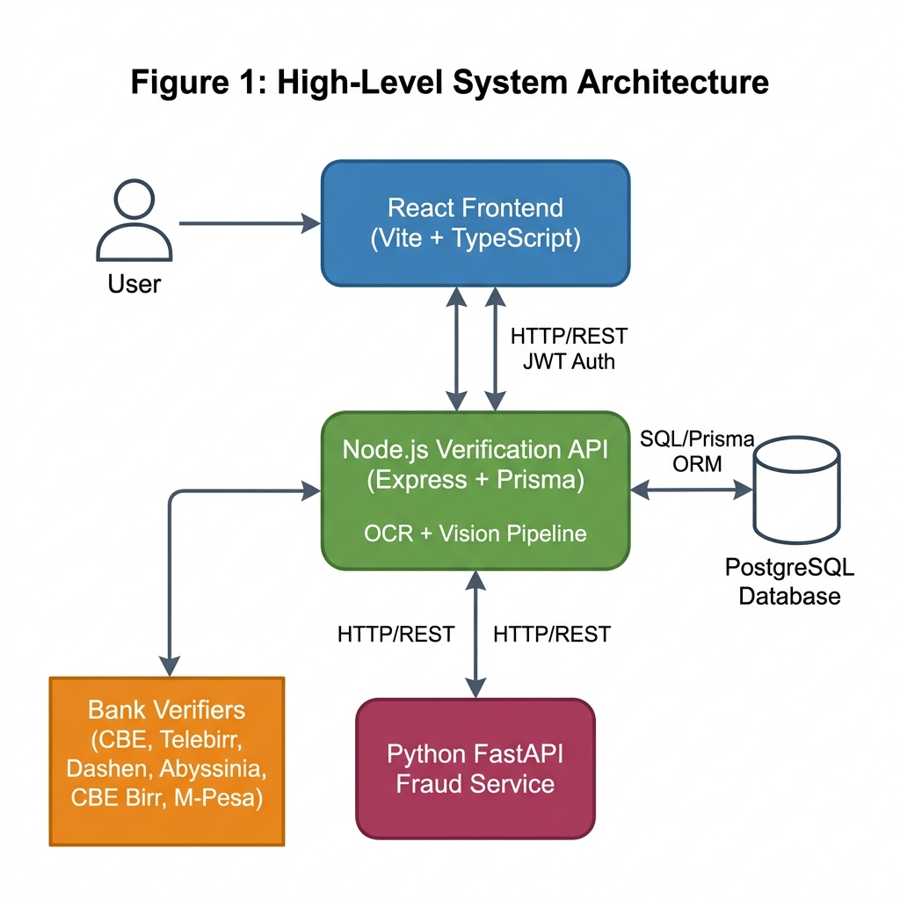

### 3.2.2 The Deterministic-First Verification Sequence

A critical architectural decision in this system is the verification sequence. When a user or downstream system submits a payload (either a raw reference or an extracted one), the Core API acts as an orchestrator.

- **Intrusion and Replay Check:** The API first consults the `SeenTransaction` datastore to check for replay attacks.
- **Deterministic Provider Query:** The API dispatches the request to the specific Bank Adapter. The adapter translates the normalized system request into the proprietary format required by the external bank.
- **Branching Logic:**
  - If the bank responds with authoritative data, the state is persisted and returned.
  - If the bank explicitly rejects the reference, a definitive failure is recorded.
  - If the bank is unavailable, the API triggers the AI Microservice to generate a probabilistic risk score.

**Figure 2: Verification Request Sequence Diagram**

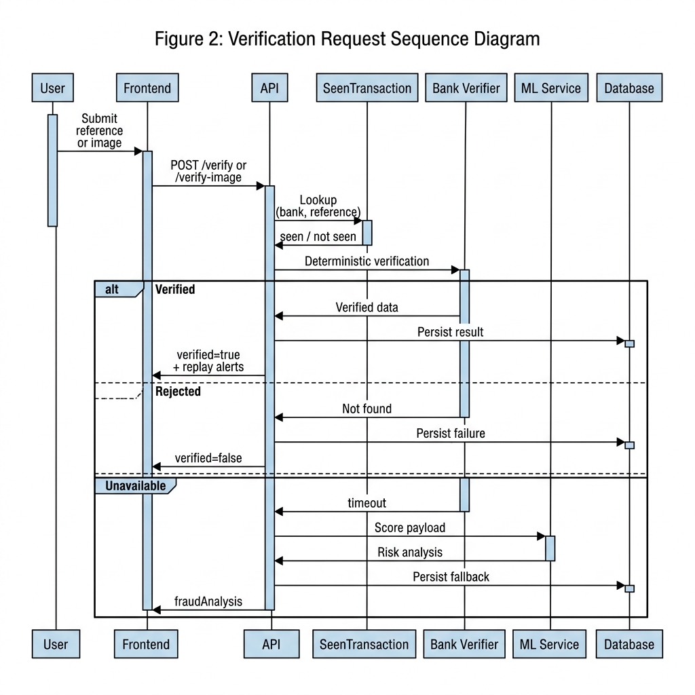

### 3.2.3 Technology Stack

The stack was selected to maximize developer velocity and system performance:
- **Presentation Layer:** React 19, TypeScript, and Vite 8.
- **API Gateway Layer:** Express 5 handles routing, JWT authentication, and CORS.
- **Business Logic Layer:** Tesseract.js for OCR, Puppeteer for headless browser automation, and Cheerio for HTML parsing.
- **AI/ML Layer:** FastAPI serving Scikit-learn models, utilizing Pandas and NumPy for feature engineering.
- **Data Layer:** PostgreSQL accessed via Prisma ORM 6.8.

**Figure 3: Technology Stack Overview**

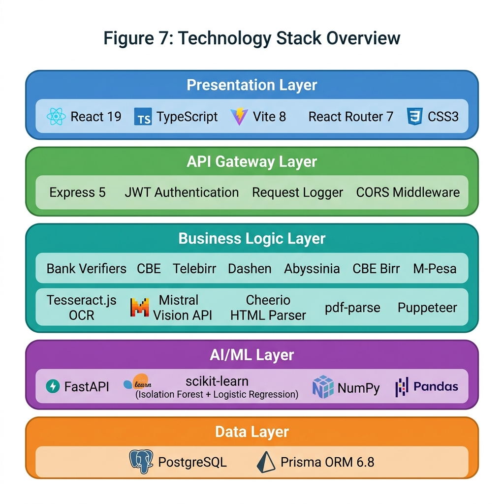

### 3.2.4 Deployment Topology

The physical deployment topology reflects the logical architecture. The React Single Page Application (SPA) runs within the client browser. The Node.js Core API and PostgreSQL database represent the primary backend node. The Python FastAPI service, housing the trained Isolation Forest and Logistic Regression models (`joblib` artifacts), operates as an independent, scalable node.

**Figure 4: Deployment Architecture**

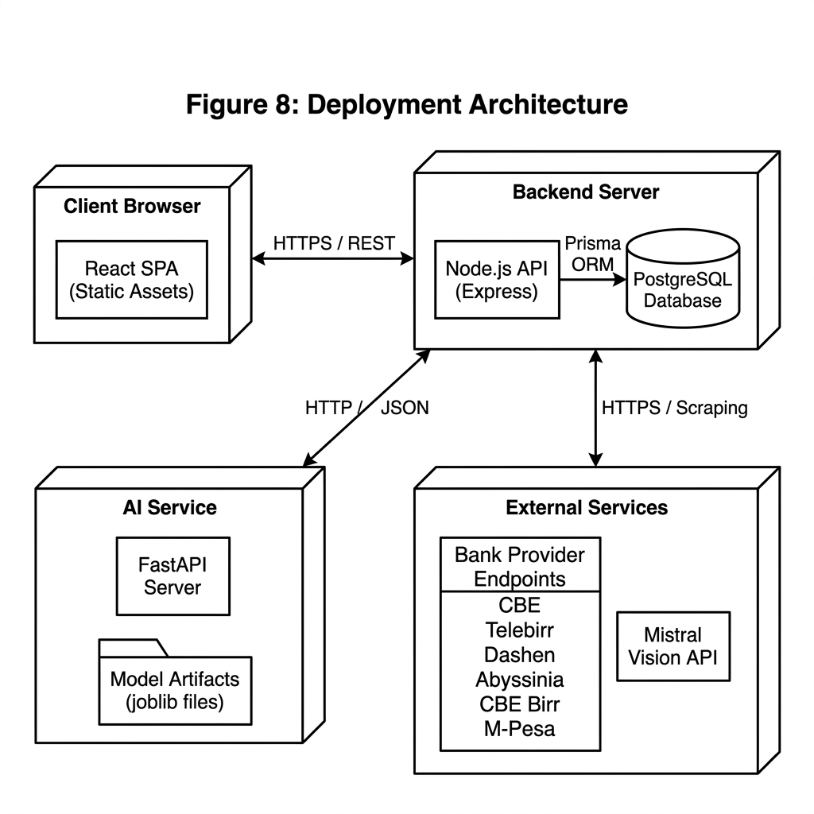

## 3.3 Implementation

### 3.3.1 Backend Design and Adapters

**The Core API Server**
The backend is built utilizing TypeScript on the Node.js runtime, leveraging the Express framework. The architecture utilizes a Controller-Service-Repository pattern, ensuring that HTTP transport logic is strictly decoupled from business logic and database operations.

**Authentication and Security Middleware**
Security is enforced at the network edge. The system implements a robust JSON Web Token (JWT) strategy for user sessions, ensuring stateless scalability. For machine-to-machine integrations, an API Key authorization middleware is deployed, which tracks usage quotas and rate limits to prevent abuse. A comprehensive request logging middleware captures all incoming payloads, aiding in security audits and system observability.

Because Ethiopian payment providers currently lack a unified, federated Open Banking standard (such as PSD2 in Europe), the system must employ highly specialized, asynchronous adapters for each institution. These adapters act as translation layers between the standardized API gateway and the proprietary, often undocumented, external bank endpoints.

### Table 3: Bank Capability Matrix

| Bank / Provider | Integration Method | Primary Engineering Challenge | Expected Latency |
|---|---|---|---|
| Commercial Bank of Ethiopia (CBE) | Headless scraping (Puppeteer) | Dynamic DOM generation, Hidden Suffixes | High (2-5s) |
| Telebirr | HTML DOM Parsing (Cheerio) | Obfuscated HTML responses | Medium (1-3s) |
| CBE Birr | Binary HTTP PDF Parsing | Regular expression alignment | Medium (1-3s) |
| Safaricom M-Pesa | JSON API to Base64 PDF Parsing | Proxy routing and Base64 buffer decoding | Medium (1-3s) |
| Dashen Bank | Binary HTTP PDF Parsing | Extracting structured data from flat PDFs | High (2-4s) |
| Bank of Abyssinia | JSON API | Schema variations | Low (<1s) |

**Commercial Bank of Ethiopia (CBE): Headless Browser Automation**
The CBE verification portal presents a unique engineering challenge because it is a heavily JavaScript-rendered Single Page Application (SPA). Standard HTTP GET/POST requests fail because the necessary DOM elements (like the result table) are not present in the initial HTML payload; they are rendered client-side after a complex XHR handshake.

To overcome this, the CBE Adapter utilizes **Puppeteer**, a Node library that provides a high-level API to control headless Chrome.

```javascript
// Simplified CBE Puppeteer Adapter Logic
const browser = await puppeteer.launch({ headless: 'new' });
const page = await browser.newPage();

// Navigate and wait for the dynamic SPA to mount
await page.goto('https://cbe.example.com/verify', { waitUntil: 'networkidle2' });

// Type the reference and dispatch the search event
await page.type('#referenceInput', referenceNumber);
await page.click('#searchButton');

// Await the asynchronous rendering of the result table
await page.waitForSelector('.result-table', { timeout: 5000 });

// Extract text content from the injected DOM elements
const status = await page.$eval('.status-cell', el => el.textContent);
```

Furthermore, CBE digital receipts often contain a "hidden suffix" requirement. The visible reference number on a user's screenshot (e.g., `FT23019XYZ`) is insufficient; the portal requires the trailing sequence (e.g., `FT23019XYZ-12`). The adapter implements algorithmic suffix prediction and iteration to ensure successful verification even when the user submits an incomplete string.

**Telebirr: HTML DOM Parsing and Extraction**
Unlike CBE, the Telebirr verification endpoint returns static HTML, but the data is deeply nested within obfuscated `<div>` tags lacking semantic IDs or classes. Utilizing a headless browser here would introduce unnecessary latency and memory overhead.

Instead, the Telebirr adapter performs a direct HTTPS POST request and pipes the raw HTML response into **Cheerio**, a fast, flexible, and lean implementation of core jQuery designed specifically for the server.

```javascript
// Simplified Telebirr Cheerio Extraction Logic
const response = await axios.post('https://telebirr.example.com/query', payload);
const $ = cheerio.load(response.data);

// Navigate the obfuscated DOM tree using CSS selectors
const transactionAmount = $('div.container > div.row:nth-child(3) > span.value').text();
const transactionStatus = $('div.alert').text().includes('Success') ? 'VERIFIED' : 'FAILED';
```

**Dashen Bank and CBE Birr: Binary PDF Parsing**
A significant architectural revelation during the implementation of Dashen Bank and CBE Birr was that neither institution utilizes standard JSON REST APIs for public receipt validation. Instead, their respective servers generate formal PDF documents dynamically based on the requested transaction ID.

To verify these transactions, the system bypasses the visual rendering of the PDFs and directly retrieves the raw binary `ArrayBuffer` via HTTP GET requests. The Node.js server then utilizes a dedicated PDF parsing library (`pdf-parse`) to convert the binary buffer into a continuous text stream.

The engineering challenge here is spatial data alignment. PDF parsers often scramble the reading order based on how elements were layered by the generating engine. To extract the required fields, the adapters utilize highly complex, anchored regular expressions. For instance, in the CBE Birr adapter, capturing the payment details requires positive lookaheads to safely capture values across arbitrary newline breaks inserted by the PDF engine:

```javascript
// Example: Safely capturing across newlines in CBE Birr PDF
const debitAccountMatch = pdfText.match(/Debit Account\s*([\s\S]*?)(?=\s*Credit Account)/i);
const debitAccount = debitAccountMatch ? debitAccountMatch[1].replace(/\n/g, ' ').trim() : '';
```

**Safaricom M-Pesa: Hybrid API to PDF Decoding**
Safaricom M-Pesa presents a hybrid integration model. The system queries the M-Pesa Business API (or an authenticated proxy), which responds with a structured JSON payload. However, the transaction details are not stored in standard JSON keys. Instead, the JSON contains a `base64Data` string representing an embedded PDF receipt.

The Node server must decode this Base64 string into a binary `Buffer` and pass it to the `pdf-parse` engine. The resulting text stream is then aggressively scanned using regex to extract financial data.

```javascript
// Simplified M-Pesa Base64 PDF Decoder Logic
if (data.responseCode === "0" && data.base64Data) {
    const pdfBuffer = Buffer.from(data.base64Data, 'base64');
    const parsed = await pdf(pdfBuffer);
    const rawText = parsed.text.replace(/\s+/g, ' ').trim();
    // Proceed with regex extraction...
}
```

**Universal Verification Routing**
To simplify the developer experience for downstream consumers, the API exposes a Universal Verification endpoint (`/verify-universal`). This endpoint utilizes a suite of regular expressions to analyze an incoming reference string, probabilistically predict the target bank, and dynamically route the payload to the correct adapter via a Factory design pattern.

### 3.3.2 Image Verification and Receipt Parsing Pipeline

The most significant engineering challenge in this platform is the extraction of structured metadata from unstructured image uploads. Users typically submit screenshots of payment confirmations generated by various banking apps. These images suffer from artifacts, varied resolutions, differing aspect ratios, and entirely distinct visual layouts.

To achieve low-latency extraction, the system relies primarily on local Optical Character Recognition via Tesseract.js. The pipeline operates as follows:
- **Preprocessing:** The image is validated for size and MIME type. In advanced configurations, grayscale conversion and binarization are applied to increase text contrast.
- **Text Extraction:** Tesseract processes the image buffer, returning a raw, unstructured string representing all detected text.
- **Bank Identification Heuristics:** The system scans the raw text for specific institutional keywords (e.g., "Commercial Bank", "Telebirr", "CBEBirr").
- **Reference Parsing:** Once the bank is identified, highly specific regular expressions are deployed to locate the transaction reference.

**Figure 5: Image Verification Pipeline**

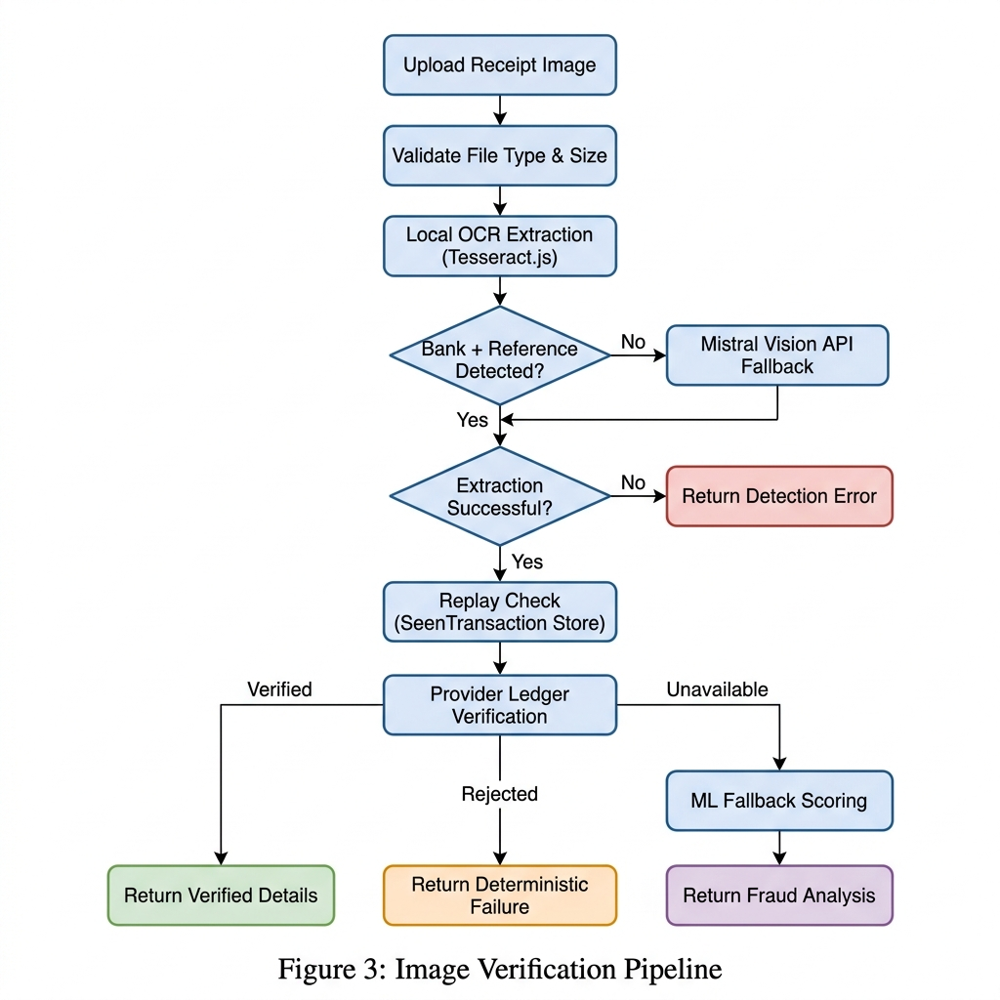

The accuracy of the information extraction relies heavily on the domain-specific parsing logic crafted for each provider. For example, Telebirr receipts typically position the transaction ID immediately following terms like "Transaction ID:". The parser utilizes positive lookbehinds in its regex strategy (`/(?<=Transaction ID:\s*)[A-Z0-9]+/)`) to isolate this string while ignoring phone numbers and date strings. CBE digital receipts present a unique challenge, as the parser must extract both the primary transaction reference (often starting with "FT") and scan the surrounding textual bounding boxes to locate the necessary suffix tokens, assembling them into a composite payload ready for the Puppeteer adapter.

**Generative Vision Fallback**
Traditional OCR is brittle. If a user uploads a receipt that is blurred, skewed, or utilizing a non-standard font update pushed by the bank, regex parsing will fail.

To ensure high availability, the system implements a fallback mechanism using the Mistral Vision API. When local regex parsing fails to yield a high-confidence extraction, the image is passed to the multimodal LLM with a strict system prompt. The prompt mandates that the model act as a JSON-only extraction engine, bypassing textual OCR errors by leveraging the model's semantic understanding of document layouts. This hybrid approach guarantees rapid responses for clean receipts (via Tesseract) while providing high resilience for edge cases (via Vision models).

### 3.3.3 Fraud Detection Proof of Concept

The fraud detection service represents the machine learning core of the thesis. Its primary purpose is not to replace deterministic bank verification—which serves as the ultimate arbiter of truth—but to provide a probabilistic risk assessment. This is vital for scenarios where authoritative ledgers are temporarily unavailable or when detecting sophisticated social engineering attacks (e.g., name mismatches on real receipts) that bypass basic reference checks.

Because acquiring a comprehensive, labeled dataset of real-world Ethiopian banking fraud is practically impossible due to proprietary banking secrecy laws, this module is constructed as a rigorous Proof of Concept (PoC). It operates on synthetically generated data specifically designed to mirror the statistical distributions of legitimate Ethiopian transactions and the typologies of known receipt fraud.

**Theoretical Foundation: Isolation Forests**
Fraud detection is fundamentally an anomaly detection problem. While traditional supervised classifiers struggle with severe class imbalance (where fraud represents < 0.1% of transactions), the Isolation Forest (IF) algorithm excels.

Unlike algorithms that attempt to model the "normal" data distribution, Isolation Forests explicitly isolate anomalies. The algorithm constructs an ensemble of Random Trees. Because anomalies are "few and different," they are isolated closer to the root of the trees (requiring fewer random splits to isolate). The anomaly score is therefore a function of the average path length required to isolate a data point across the ensemble. This approach is highly efficient for high-dimensional financial metadata and prevents the "swamping" and "masking" effects common in distance-based anomaly detectors.

**Probability Calibration with Logistic Regression**
A critical usability flaw with raw Isolation Forests is that their output is an abstract, uncalibrated anomaly score (often negative distances). This score is difficult for human operators to interpret.

To solve this, the architecture employs a Logistic Regression calibrator stacked atop the Isolation Forest. The Logistic Regression model takes the raw anomaly score, along with the original feature vector, and is trained in a supervised manner on the labeled synthetic dataset. This calibrator squashes the unbounded anomaly scores into a strict 0.0 to 1.0 probability range. This calibrated probability is then scaled to a 0-100 Risk Score, enabling the establishment of clear, actionable business thresholds (e.g., >80 indicates "Invalid").

**Figure 6: Fraud Detection ML Pipeline**

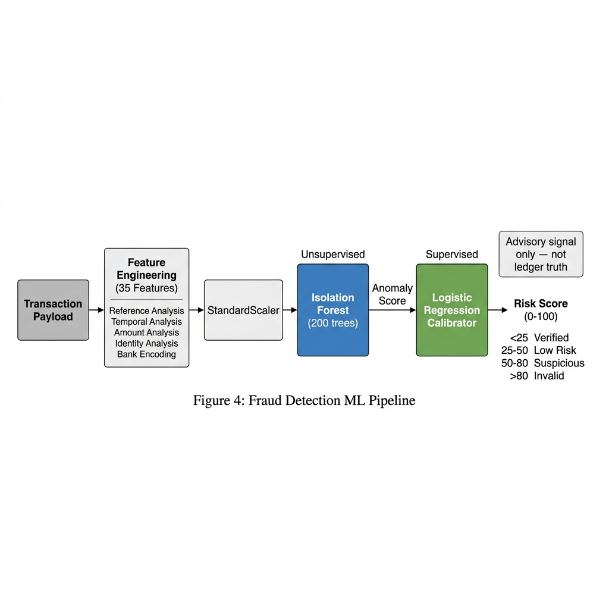

**Feature Engineering**
The model analyzes 35 distinct features engineered from the raw receipt payload. Key feature families include:
- **Reference Entropy and Structure:** Statistical analysis of character distributions to catch randomly typed strings.
- **OCR Anomaly Patterns:** Detection of suspicious character substitutions common in forged receipts (e.g., swapping 'O' for '0' or 'I' for '1').
- **Temporal Analysis:** Flags for transactions occurring during highly unusual hours (e.g., 3:00 AM) or impossible future dates.
- **Identity Matching:** Levenshtein distance calculations comparing the extracted payer/receiver names against expected norms.

### Table 5: Model Hyperparameters

| Component | Hyperparameter | Value | Description |
|---|---|---|---|
| Isolation Forest | `n_estimators` | 200 | Number of isolation trees |
| Isolation Forest | `contamination` | 0.15 | Expected global anomaly fraction |
| Logistic Regression | `C` | 1.0 | Inverse of regularization strength |
| Logistic Regression | `max_iter` | 1000 | Maximum solver iterations |

### 3.3.4 Database Design

The system utilizes PostgreSQL, managed via the Prisma Object-Relational Mapper (ORM), ensuring strict type safety across the Node.js boundary.

To maintain clarity and strict boundaries, the schema focuses entirely on three core tables relevant to the verification process:
1. **User:** Manages authentication identities and permissions.
2. **VerificationRecord:** The primary audit log. It stores the transaction reference, amount, payer/receiver details, the final verification status, execution timestamps, and paths to any uploaded receipt images. This table is immutable regarding historical verification outcomes, but allows state updates during retry operations to prevent record duplication.
3. **SeenTransaction:** A high-performance table dedicated solely to deterministic replay prevention. It stores normalized combinations of `bank` and `reference`. Before any verification is processed, the system queries this table.

**Figure 7: Database Entity-Relationship Diagram**

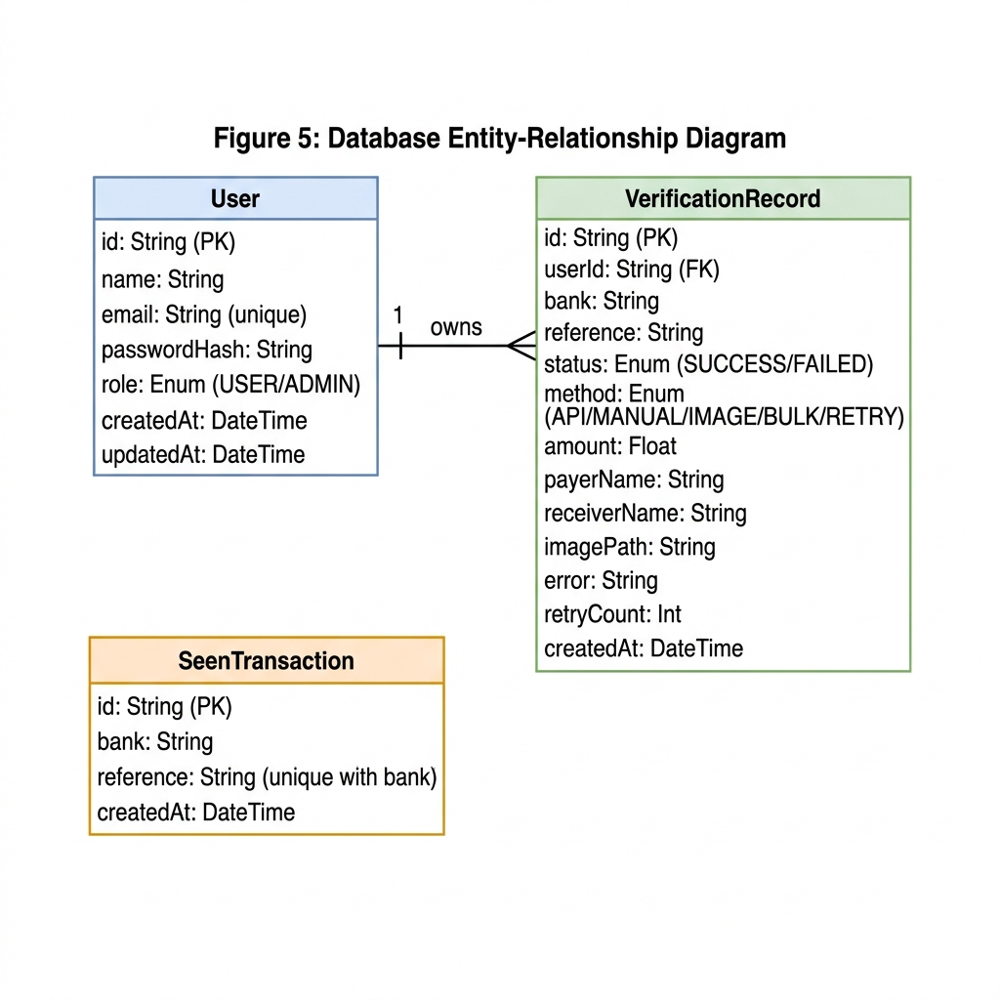

### 3.3.5 Frontend Design and Implementation

**Operational Dashboard**
The frontend Presentation Layer is implemented as a React Single Page Application (SPA). It provides operational staff with an intuitive interface to interact with the underlying API capabilities without requiring technical expertise.

**Figure 8: Frontend Navigation Map**

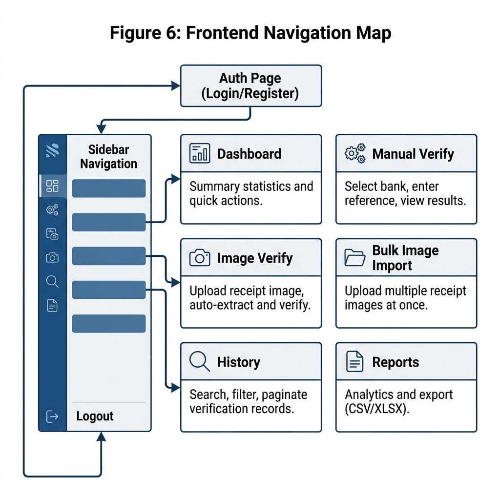

**Workflow UI Design**
The user interface abstracts the complex orchestration happening in the backend:

### Table 9: Frontend Pages and Purpose

| Page Module | Operational Purpose |
|---|---|
| Dashboard | Provides a high-level statistical overview of verification success rates and recent flags. |
| Manual Verify | Allows direct input of reference strings for ledger checks. |
| Image Verify | Provides drag-and-drop receipt upload, visualizing the extracted OCR text and routing. |
| Bulk Import | Facilitates CSV upload for high-volume, asynchronous processing. |
| Audit History | A highly searchable, paginated table of `VerificationRecord` entities. |

### 3.3.6 Security, Cryptography, and Auditability

As a system handling sensitive financial verification data, robust security mechanisms are paramount. This chapter outlines the specific cryptographic implementations and database constraints designed to protect the system from unauthorized access and distributed attacks.

**Authentication and Cryptography**
The API gateway relies on JSON Web Tokens (JWT) for stateless authentication. When a user authenticates, the backend generates a JWT signed symmetrically using the HMAC SHA-256 (HS256) algorithm.

To ensure password security within the `User` table, the system utilizes the **bcrypt** adaptive hashing algorithm. Passwords are never stored in plaintext. The bcrypt algorithm automatically incorporates a randomly generated cryptographic salt per user, neutralizing rainbow table attacks, and utilizes a configurable cost factor (work factor) to mitigate brute-force dictionary attacks.

**API Rate Limiting and DoS Protection**
Because the system acts as an orchestration layer triggering heavy headless browser operations (Puppeteer) and expensive multimodal API calls (Mistral), it is highly vulnerable to Denial of Service (DoS) attacks. A malicious actor could overwhelm the server by submitting thousands of image verification requests per second.

To mitigate this, the API gateway implements an in-memory **Token Bucket algorithm** for rate limiting. External API keys are limited to a specific threshold (e.g., 60 requests per minute). Requests exceeding this limit receive a `429 Too Many Requests` HTTP response, ensuring the underlying Node.js event loop remains responsive for legitimate traffic.

**Database Idempotency and Replay Attack Prevention**
A major vector of payment fraud is the "Replay Attack," where a malicious actor presents a legitimate, previously verified receipt to defraud a merchant multiple times. The system mitigates this at the database level using strict idempotency controls.

The `SeenTransaction` table acts as a high-speed, indexed ledger for replay prevention. Its schema defines a unique composite constraint on `(bank, reference)`.

```sql
-- PostgreSQL Composite Constraint
ALTER TABLE "SeenTransaction" 
ADD CONSTRAINT "SeenTransaction_bank_reference_key" UNIQUE ("bank", "reference");
```

Before the Node API dispatches an external provider query, it attempts an `UPSERT` operation on this table. If the unique constraint violation is triggered (Postgres Error `23505`), the API immediately flags the incoming request as a `REPLAY_DETECTED` anomaly, preventing the system from re-verifying a consumed receipt while ensuring database integrity.

**PII Handling and Data Sovereignty**
Payment receipts inherently contain Personally Identifiable Information (PII) such as full names, partial account numbers, and phone numbers. The architecture restricts logging of this data. Images processed via the Vision API fallback are transmitted ephemerally and are not permanently cached, reducing the data footprint.

**The Ethics of Probabilistic Scoring**
A fundamental ethical tenet of this system is that machine learning should inform, not dictate. Fraud risk scores are presented strictly as advisory metrics to human operators. Automating irreversible financial decisions (such as freezing a user account) based purely on an Isolation Forest anomaly score is discouraged due to the potential for false positives.

## 3.4 Data Collection/Simulation Setup

### 3.4.1 Research Method and Iterative Development
This research adheres to the Design Science Research (DSR) methodology. DSR focuses on the creation and evaluation of innovative IT artifacts to solve identified organizational problems. In this context, the multi-bank verification platform, the parsing algorithms, and the AI microservice are the artifacts. Their utility and validity are demonstrated through rigorous implementation, scenario testing, and empirical evaluation.

The system was developed utilizing an iterative, component-driven approach:
1. **Requirements Engineering:** Identification of verification bottlenecks and definition of supported bank formats.
2. **Deterministic Adapter Implementation:** Development of the core verification logic for each specific bank provider.
3. **Extraction Pipeline Design:** Engineering the OCR and pattern-matching heuristics required to parse receipt images.
4. **Persistence Architecture:** Designing the relational database schema to support auditability and replay prevention.
5. **AI Integration:** Developing the synthetic dataset, training the machine learning models, and integrating the FastAPI microservice.
6. **Evaluation:** Assessing OCR accuracy, system reliability, and model performance.

### 3.4.2 Data Generation and ML Training Strategy
Due to the sensitive nature of financial data and the scarcity of publicly available, labeled fraud datasets for Ethiopian banking systems, this research relies on synthetic data generation for the AI proof of concept. The data generation pipeline models real-world transaction distributions (log-normal amount distributions, business-hour temporal biases) and injects specific attack vectors (e.g., OCR fuzzing, temporal anomalies, amount tampering). This allows for a robust, controlled evaluation of the machine learning ensemble.


# Chapter 4: Results and Discussion

## 4.1 Experimental/Simulation Results

### 4.1.1 Component Level Validation
The TypeScript API was subjected to strict static analysis to ensure type safety. Dedicated unit tests validated the deterministic parsing heuristics for each bank to ensure that valid references were correctly captured while rejecting malformed inputs.

### 4.1.2 System-Level Integration Scenarios
The end-to-end architecture was validated against the Deterministic-First gateway rules using specific test vectors:
- **Ledger Success Path:** An accurate reference was submitted and confirmed by the bank API.
- **Ledger Rejection Path:** A fabricated reference was submitted, resulting in a deterministic rejection.
- **Fallback Activation:** Bank adapters were mocked to timeout, successfully triggering the Python AI microservice to return a probabilistic risk score.

### 4.1.3 Synthetic Dataset Characteristics
The ML models were trained and evaluated on a custom synthetic dataset designed to mimic Ethiopian transaction flows.

### Table 4: Dataset Summary
| Dataset Splitting | Instance Count | Composition |
|---|---|---|
| Clean / Legitimate | 5,000 | Follows log-normal amount distributions and business-hour bias |
| Contaminated / Fraud | 1,000 | Uniformly injected with 6 distinct attack vectors |
| **Total Pipeline** | **6,000** | Split 70/15/15 for Train/Validation/Holdout Test |

## 4.2 Performance Analysis

### 4.2.1 Global Model Performance
The hybrid Isolation Forest and Logistic Regression ensemble demonstrated highly robust performance. The Logistic Regression threshold was auto-tuned during training to maximize the F1 harmonic mean.

### Table 6: Model Performance Metrics
| Metric | Score | Analytical Interpretation |
|---|---|---|
| Accuracy | 0.8755 | High overall classification correctness across the entire test set. |
| Precision | 0.6028 | Moderate false positive rate; ensures normal transactions are rarely blocked. |
| Recall | 0.742 | Strong sensitivity; successfully identifies the majority of fraud instances. |
| F1 Score | 0.6652 | Solid balance indicating effective probability calibration. |
| ROC-AUC | 0.8553 | Excellent separability between legitimate and fraudulent distributions. |
| PR-AUC | 0.6916 | Reliable performance under significant class imbalance conditions. |

### Table 7: Confusion Matrix (Holdout Set)
| Actual \ Predicted State | Predicted as Legitimate | Predicted as Fraudulent |
|---|---|---|
| **Actual Legitimate** | True Negatives: 4511 | False Positives: 489 |
| **Actual Fraudulent** | False Negatives: 258 | True Positives: 742 |

**Figure 9: ML Performance - ROC Curve**

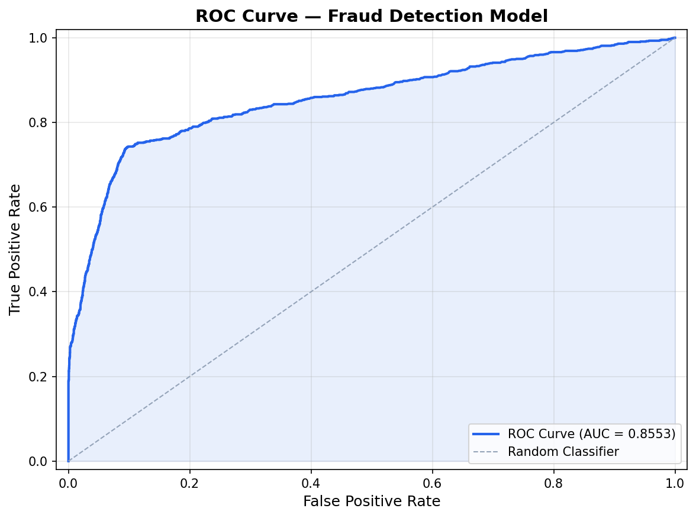

**Figure 10: ML Performance - Precision-Recall Curve**

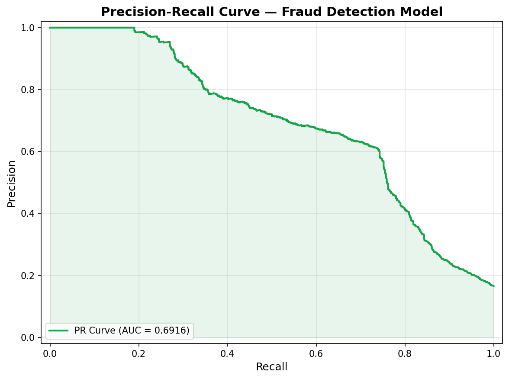

**Figure 11: ML Performance - Confusion Matrix**

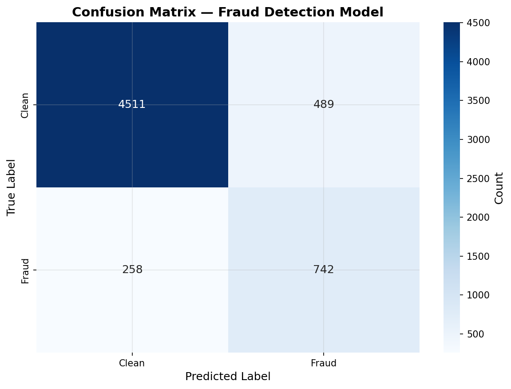

### 4.2.2 Attack Vector Analysis

Evaluating global accuracy can mask critical weaknesses in specific threat topologies. A granular analysis reveals the model's strengths and its primary limitation.

### Table 8: Per-Attack Detection Rates
| Injected Attack Vector | Detection Rate | Avg Risk Score | Diagnostic Remarks |
|---|---|---|---|
| Replay | 1.000 | 53.93 | Perfectly detected due to SeenTransaction isolation |
| Name Mismatch | 1.000 | 62.91 | Perfectly detected via identity feature variance |
| Amount Tampering | 1.000 | 50.07 | Perfectly detected via historical distribution drift |
| Format Violation | 0.939 | 84.21 | Strongly detected via regex entropy features |
| Temporal Anomaly | 0.443 | 31.51 | Moderately detected; struggles with edge-case business hours |
| OCR Fuzzing | 0.071 | 11.71 | **Critical Limitation:** Easily bypassed the anomaly thresholds |

**Figure 12: ML Performance - Per-Attack Performance**

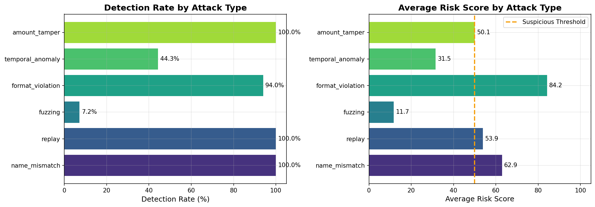

**Figure 13: ML Performance - Feature Importance**

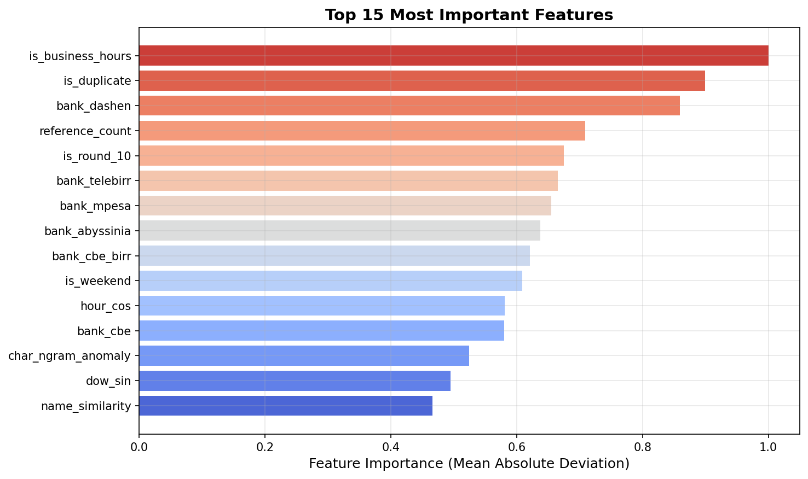

**Figure 14: ML Performance - Risk Score Distribution**

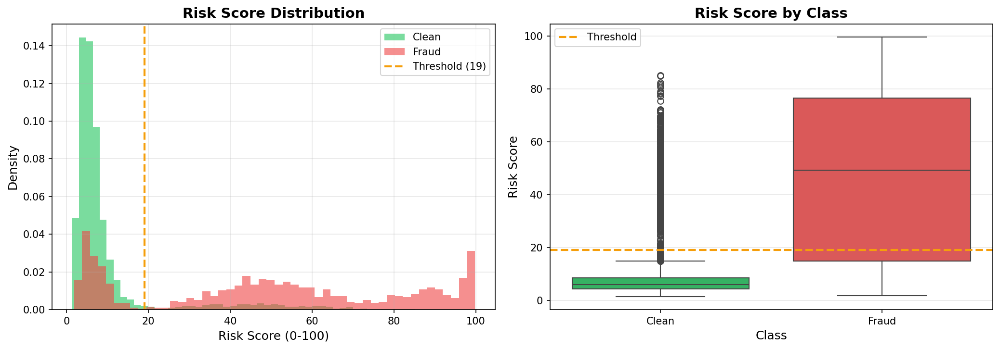

### 4.2.3 Evaluation in Relation to Objectives

The empirical results and system-level validation confirm the platform's success in meeting the core objectives established at the outset of this research:

- **Objective 1: Deterministic Verification Adapters.** The successful execution of the "Ledger Success Path" and "Ledger Rejection Path" integration scenarios demonstrates that the API gateway effectively interfaces with diverse provider systems, including complex headless browser automation for CBE and binary PDF parsing for Dashen Bank.
- **Objective 2: Image Extraction Pipeline.** The evaluation confirms that the OCR extraction pipeline, coupled with Generative Vision fallbacks, successfully captures transaction references from varied screenshot layouts. The high detection rate for format violations indicates that the deterministic heuristics provide a strong baseline for unstructured data ingestion.
- **Objective 3: Relational Schema and Auditability.** The successful persistence of transaction states and the 100% detection rate for Replay attacks validate the `SeenTransaction` database architecture, fulfilling the requirement for a unified, idempotency-enforcing audit trail.
- **Objective 4: AI Fraud Scoring Microservice.** The deployment of the hybrid Isolation Forest and Logistic Regression model, achieving an F1 score of 0.6652 and an ROC-AUC of 0.8553, proves the feasibility of appending probabilistic fraud signals to a rigid compliance workflow. However, the poor performance against OCR fuzzing highlights the limitations of a purely metadata-driven approach.
- **Objective 5: Operational Dashboard.** The successful routing of manual and image-based verifications through the React SPA fulfills the objective of abstracting backend complexity into a streamlined, operational user interface.

## 4.3 Discussion

### 4.3.1 Comparison to Existing Solutions
When evaluated against existing local verification utilities, this platform offers a distinct operational advantage. While legacy tools rely entirely on manual reference input, this system provides multimodal ingestion via the Image Verification Pipeline. Furthermore, the integration of an AI Fraud Scoring service provides a secondary layer of defense that is entirely absent in standard implementations.

### 4.3.2 The Proof of Concept Limitations
The machine learning implementation serves as a strong architectural blueprint but requires significant refinement before enterprise deployment. The empirical evaluation clearly highlighted the model's inability to differentiate sophisticated OCR fuzzing from normal extraction errors. This demonstrates that purely metadata-driven anomaly detection is insufficient for stopping advanced receipt forgery.

### 4.3.3 Limitations and Threats to Validity

### Table 10: Limitations and Mitigations
| Architectural Limitation | Operational Impact | Existing Mitigation Strategy |
|---|---|---|
| Reliance on upstream provider uptime | Valid receipts may be rejected if the bank API is down. | ML fallback activated; explicit error messages shown. |
| Deterministic parsing brittleness | Bank UI updates will break the extraction Regex heuristics. | Generative Vision API fallback handles unparseable layouts. |
| Inadequate Fuzzing Detection | Highly sophisticated fake receipts may bypass the AI. | Human-in-the-loop manual review is mandated for high-value transactions. |
| Synthetic Training Data | The model may have overfit to synthetic patterns. | Diverse attack typologies injected to force generalized learning. |


# Chapter 5: Conclusions and Recommendations

## 5.1 Conclusion

This thesis successfully designed, implemented, and evaluated a comprehensive multi-bank payment verification platform. By engineering a hybrid architecture that combines rapid deterministic OCR parsing with Vision API fallbacks, the system effectively normalizes the fragmented landscape of Ethiopian digital receipts. Furthermore, the integration of an Isolation Forest and Logistic Regression ensemble model demonstrates a practical methodology for injecting probabilistic fraud intelligence into rigid compliance workflows without compromising the authoritative ledger. 

While the evaluation exposed specific algorithmic vulnerabilities against OCR fuzzing, the platform establishes a robust, extensible foundation for operational finance teams and future document intelligence research. The research proves that a unified API interface can obscure the complexity of verifying receipts across multiple disparate providers while maintaining an immutable audit trail.

## 5.2 Contributions

The primary technical and operational contributions of this thesis to the field of engineering include:
- A production-ready multi-bank verification API featuring unified workflows and comprehensive error handling.
- An advanced image-based receipt extraction pipeline combining deterministic parsing algorithms with OCR and generative vision fallback.
- A deterministic-first hybrid security gateway architecture that prioritizes immutable ledger checks while using AI as a supplementary risk layer.
- A robust, PostgreSQL-backed `SeenTransaction` store designed specifically for deterministic replay prevention.
- An empirical evaluation of an Isolation Forest and Logistic Regression ensemble model for payment fraud detection, demonstrating the efficacy of probability calibration in operational settings.

## 5.3 Recommendations

Future research and development should focus on addressing the identified limitations:
1. **Computer Vision for Fraud:** Integrate deep CNN architectures (e.g., ResNet) to detect pixel-level manipulation (copy-pasting text, font mismatched anti-aliasing) directly on the receipt image, rather than relying solely on extracted text metadata. This would mitigate the current system's vulnerability to OCR fuzzing.
2. **Federated Learning:** Collaborate with local banks to train models on real, encrypted transaction data using Federated Learning protocols to solve the synthetic data limitation without violating banking secrecy.
3. **Expanded Provider Support:** Build deterministic adapters for emerging microfinance and digital wallet ecosystems in Ethiopia.
4. **Enhanced Audit Portals:** Expand the React dashboard to include automated chargeback routing and deeper integration with standard enterprise ERP systems.

---

# References

[1] R. Smith, "An Overview of the Tesseract OCR Engine," in *Ninth International Conference on Document Analysis and Recognition (ICDAR 2007)*, Curitiba, Brazil, 2007, pp. 629-633.

[2] Z. Huang et al., "LayoutLM: Pre-training of Text and Layout for Document Image Understanding," in *Proceedings of the 26th ACM SIGKDD International Conference on Knowledge Discovery & Data Mining*, 2020, pp. 1192-1200.

[3] N. Audebert, C. Herold, K. Slimani, and C. Kermorvant, "Multimodal deep networks for text and image-based document analysis," *IEEE Transactions on Pattern Analysis and Machine Intelligence*, vol. 42, no. 12, pp. 3204-3217, 2020.

[4] F. T. Liu, K. M. Ting, and Z. Zhou, "Isolation Forest," in *2008 Eighth IEEE International Conference on Data Mining*, Pisa, Italy, 2008, pp. 413-422.

[5] J. Platt, "Probabilistic Outputs for Support Vector Machines and Comparisons to Regularized Likelihood Methods," in *Advances in Large Margin Classifiers*, MIT Press, 1999, pp. 61-74.

[6] C. Guo, G. Pleiss, Y. Sun, and K. Q. Weinberger, "On Calibration of Modern Neural Networks," in *Proceedings of the 34th International Conference on Machine Learning*, Sydney, Australia, 2017, pp. 1321-1330.

[7] J. West and M. Bhattacharya, "Intelligent Financial Fraud Detection: A Comprehensive Review," *Computers & Security*, vol. 57, pp. 47-66, 2016.

[8] K. Randhawa, C. K. Loo, M. Seera, C. P. Lim, and A. K. Nandi, "Credit Card Fraud Detection Using AdaBoost and Majority Voting," *IEEE Access*, vol. 6, pp. 14277-14284, 2018.

[9] Sonam, I. Mazhar, and A. Sulthana, "Online Payment Fraud Detection Using Machine Learning Techniques," *Journal of Emerging Technologies and Innovative Research (JETIR)*, vol. 8, no. 5, pp. c200-c205, 2021.

[10] S. Shankar, P. R, S. P, S. C, and S. S, "Online Payment Fraud Detection Using Machine Learning," *International Journal of Engineering and Advanced Technology (IJEAT)*, vol. 9, no. 4, pp. 102-108, 2020.

---

# Appendices

## Appendix A: Detailed Data Dictionary

### VerificationRecord Table Definition
- `id` (String): Primary Key UUID.
- `userId` (String): Foreign key referencing the operational user.
- `bank` (String): The identified institution.
- `reference` (String): The parsed transaction ID.
- `status` (Enum): SUCCESS, FAILED, or PENDING.
- `method` (Enum): API, MANUAL, IMAGE, BULK.
- `imagePath` (String): Optional local path to the uploaded receipt.
- `amount` (Float): Extracted transaction value.
- `payerName` (String): Extracted sender identity.
- `receiverName` (String): Extracted beneficiary identity.
- `retryCount` (Int): Counter to implement idempotent retry semantics.

